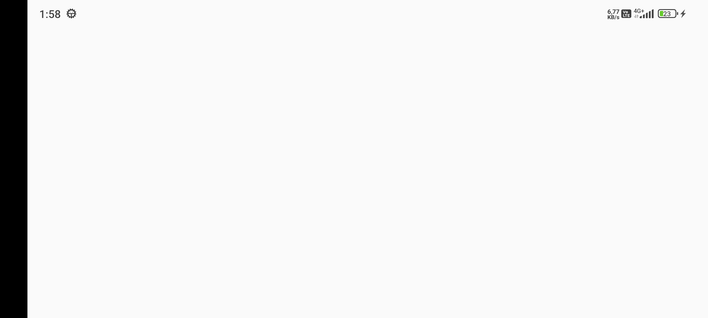
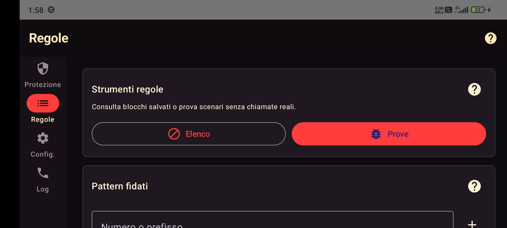
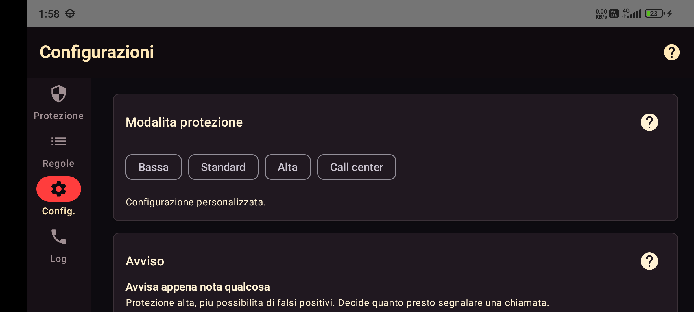

# FreyaShield

<p align="center">
  
</p>

<p align="center">
  <strong>Privacy-first mobile call protection for Android and iOS.</strong><br>
  FreyaShield aiuta a riconoscere spoofing, spam e pattern sospetti senza salvare numeri in chiaro.
</p>

<p align="center">
  
  
  
  
</p>

## Visione

FreyaShield nasce come app mobile anti-spoofing e anti-spam con una regola semplice: la protezione deve restare utile senza trasformarsi in raccolta dati.

Il progetto combina un `core_engine` in C++20, integrazione Android tramite JNI e uno scaffold iOS con SwiftUI e Call Directory Extension. L'obiettivo e avere un motore condiviso, testabile e portabile, con log locali ridotti e impostazioni gestite sul dispositivo.

## Cosa fa

- Valuta le chiamate con euristiche locali contro spoofing, spam e pattern numerici sospetti.
- Protegge whitelist e soglie policy con persistenza locale cifrata su Android.
- Mostra statistiche aggregate degli ultimi 7 giorni senza numeri in chiaro.
- Integra `GuardianCallScreeningService` su Android.
- Prepara il percorso iOS con SwiftUI, Call Directory Extension e App Group.

## Anteprima Android

| Dashboard | Regole | Impostazioni |
|---|---|---|
|  |  |  |

## Architettura

```text
FreyaShield
├── core_engine/      C++20 decision engine, analyzer, spoof detector, tests
├── android/          Kotlin, Compose, CallScreeningService, JNI bridge
└── ios/FreyaShield/  SwiftUI scaffold, Call Directory Extension, shared store
```

### Core C++20

Il motore include euristiche per:

- verifica operatore fallita o passata;
- neighbor spoofing;
- alta frequenza;
- primo contatto internazionale;
- pattern numerici artificiali;
- whitelist esatta o con wildcard finale.

### Android

L'MVP Android include:

- progetto Gradle con Kotlin e Compose;
- `GuardianCallScreeningService` registrato nel manifest;
- bridge JNI verso il core C++20;
- dashboard Compose con stato del ruolo Call Screening;
- schermate per whitelist, soglie policy, log e impostazioni;
- storage locale cifrato tramite Android Keystore;
- statistiche aggregate locali senza numeri in chiaro.

### iOS

Lo scaffold iOS include:

- app SwiftUI;
- Call Directory Extension;
- store condiviso via App Group;
- whitelist/blocklist e reload dell'estensione;
- log locale limitato;
- note sui limiti Apple rispetto allo screening in tempo reale.

Le istruzioni iOS sono in [`ios/FreyaShield/README.md`](ios/FreyaShield/README.md).

## Build del core

Con MSYS2 UCRT64 installato:

```powershell
C:\msys64\usr\bin\bash.exe -lc 'export PATH=/ucrt64/bin:$PATH; cd /c/Users/rober/Documents/New\ project && cmake -S core_engine -B core_engine/build -G Ninja && cmake --build core_engine/build && ./core_engine/build/callguardian_core_tests.exe'
```

Con CMake installato:

```powershell
cmake -S core_engine -B core_engine/build
cmake --build core_engine/build --config Release
.\core_engine\build\Release\callguardian_core_tests.exe
```

Su Windows servono:

- Visual Studio Build Tools con workload "Desktop development with C++";
- Windows SDK;
- CMake nel PATH, oppure CMake installato con Visual Studio.

Se `cl` fallisce con `crtdbg.h: No such file or directory`, manca il componente Windows SDK/C++ runtime headers nei Build Tools.

## Build Android

Con il Gradle incluso in `.tools`:

```powershell
.\.tools\gradle-8.9\bin\gradle.bat -p android assembleDebug
```

L'APK debug viene generato in:

```text
android/app/build/outputs/apk/debug/app-debug.apk
```

## Stato del progetto

FreyaShield e in fase MVP. Il core e testabile, Android ha gia una base funzionante, mentre iOS e impostato come scaffold tecnico da completare su macOS/Xcode.

Prossimi passi:

- aggiungere test Android per servizio e bridge con input vuoti/null;
- collegare il bridge Objective-C++ iOS al `core_engine`;
- creare il progetto Xcode reale con App Group e Call Directory target;
- testare Call Directory su device fisico;
- rafforzare la documentazione privacy e il threat model.

## Nota privacy

FreyaShield e progettato per minimizzare i dati trattati: le decisioni sono locali, i log sono limitati e le statistiche sono aggregate. Il progetto non dipende da upload di rubriche o numeri verso servizi esterni.
